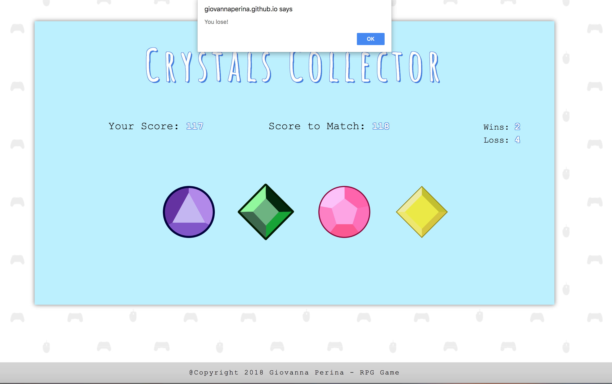

# Crystals Collector 

Crystals Collector is a fun and interactive game for web browsers. The app is dynamically updating the HTML pages with the jQuery library.

---

## Instructions

- There will be four crystals displayed as buttons on the page.
- Every time the game start will be given a random number.
- When the player clicks on crystal, it will add a specific amount of points to the player's total score. 
- The player wins if their total score matches the random number.
- The players loses if their score goes above the random number.
- The game restarts whenever the player wins or loses.

 Good Luck!!

 

---
 
 

 ---
  
